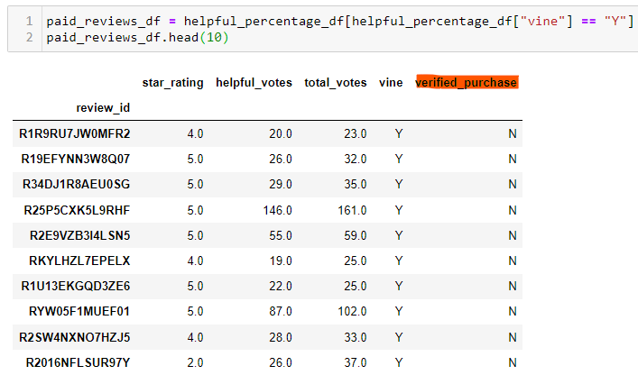
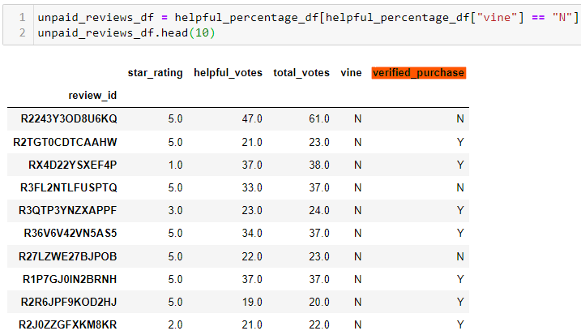

# Amazon_Vine_Analysis

## Overview of the analysis

In this project I analyze Amazon reviews written by members of the paid Amazon Vine program. The Amazon Vine program is a service that allows manufacturers and publishers to receive reviews for their products. Companies like SellBy pay a small fee to Amazon and provide products to Amazon Vine members, who are then required to publish a review.

**Process:** 

- I picked a large dataset of musical instrument reviews. 
- I used PySpark to perform the ETL process to extract the dataset, transform the data, connect to an AWS RDS instance, and load the transformed data into pgAdmin. 
- I then used Pandas to determine if there is any bias toward favorable reviews from Vine members in your dataset. For this project, I measure bias by asking if having a paid Vine review makes a difference in the percentage of 5-star reviews.

## **Results**

Of the filtered dataset, the following was the breakdown:

- 60 total Vine (paid) reviews and 14477 total non-Vine (unpaid) reviews
- 34 of the total Vine reviews were 5 stars and 8212 total non-Vine (unpaid) reviews were 5 stars
- 57% of Vine reviews (over the Vine total) were 5 stars and surprisingly 57% percentage of non-Vine reviews were 5 stars

## Summary

In summary, my analysis did not find any positivity bias for reviews in the Vine (paid) program based on the distribution of five star reviews. As seen in the results above, the percentage of the total five star for both types was equal. 

**Further analysis:**

- To uncover the distribution of stars (comparing 1-4 star-ratings) might uncover potential disparity.

- Of the 60 sampled Vine reviews, none of the of them are labeled as "verified_purchase". Deeper analysis with a larger dataset might show a trend reveal potential dishonesty in the reviews. Additional research may be needed to determine how items are labeled as "verified purchase".  See the figures below:

  *Paid_reviews:*

  

  *Unpaid reviews:* 

